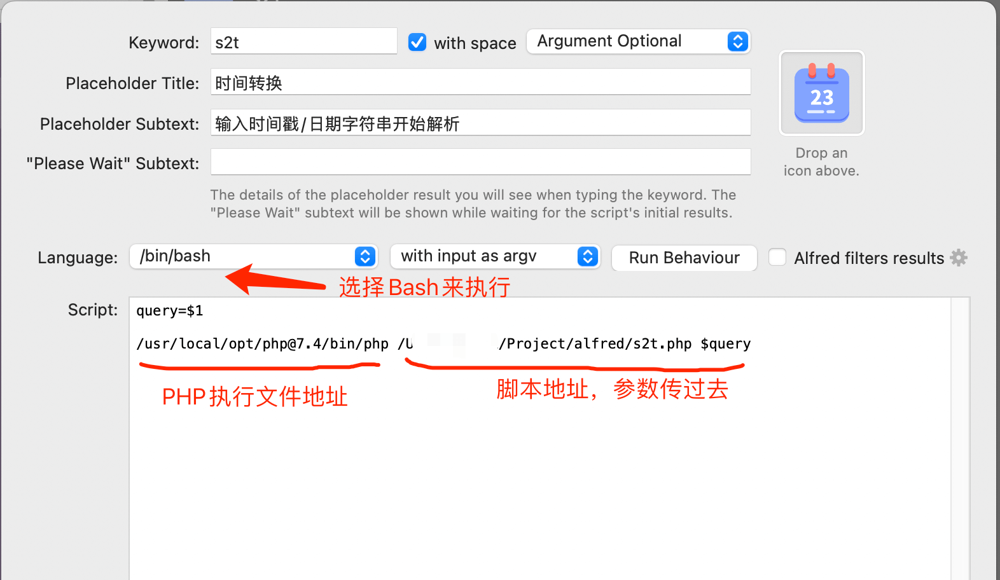

## Alfred workflow 开发脚本&配置
> Alfred workflow应该很多人都非常喜欢，基本上极大提高了日常工作效率，但是关于 workflow script脚本的开发找了半天没有找到一篇非常清晰的文章，所以记录一下这一次摸索过程，帮助后人踩坑,当然这里的脚本不限于PHP，用其他语言也是同理
### 如何使用

- `git pull https://github.com/weiwei2012holy/alfred`
- `composer install -vvv`

### 核心原理

> 脚本需要输出一个JSON数据，JSON的内容由Alfred预先定义,只需要根据自己的需求，在脚本中处理完成想要的业务逻辑后，返回对应的数据即可,
> [点击查看JSON文档描述地址](https://www.alfredapp.com/help/workflows/inputs/script-filter/json)

### 简易教程

> 开发一个时间字符串和时间相互转换的脚本,输入字符串日期转换成时间戳，输入时间戳转换成字符串日期，最后复制到剪贴板

1. 创建模版
   
2. 配置基本信息
   
3. 选中script filter打开设置
   
4. 配置脚本信息,keyword=触发关键字，注意4.*版本不能直接使用PHP解析器，需要用bash来触发，`$1`表示输入的参数1，也可以用`$*`表示全部参数
   
5. 脚本开发,引入扩展包：https://www.alfredphpworkflows.com
   ,包定义好了各种JSON数据对应的方法，基本一看就会,当前教程脚本为`s2t.php`
6. 添加输出事件，我们这里直接复制到剪贴板
   
7. 双击剪贴板打开设置，我们这里复制脚本里面设置的`date`变量，用`{var:date}`来获取
   
8. 设置复制完成后关闭Alfred
   
9. 使用效果
   

